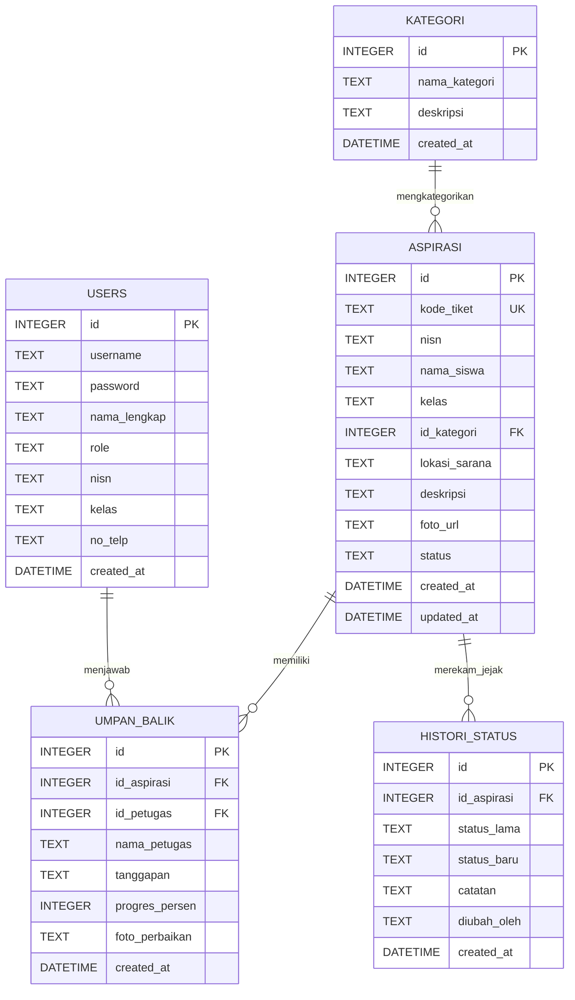

# DOKUMENTASI RESMI PROYEK UJI KOMPETENSI KEAHLIAN (UKK)
## TAHUN PELAJARAN 2025/2026
**Satuan Pendidikan** : Sekolah Menengah Kejuruan (SMK)  
**Konsentrasi Keahlian** : Rekayasa Perangkat Lunak (RPL)  
**Kode Soal** : KM25.4.1.1  
**Bentuk Soal** : Penugasan Perorangan  
**Judul Tugas** : Pengembangan Aplikasi Pengaduan Sarana Sekolah  

---

## 1. DESKRIPSI PROGRAM & ARSITEKTUR SISTEM

### 1.1 Deskripsi Umum
Aplikasi **SARPRAS CARE** adalah sistem informasi pengaduan sarana dan prasarana sekolah berbasis web berkinerja tinggi yang dikembangkan menggunakan bahasa pemrograman **Rust** dengan framework web **Axum** dan database **SQLite**.

Aplikasi ini memiliki 2 portal utama sesuai spesifikasi penugasan UKK:
1. **Portal Siswa**:
   - Formulir aspirasi sarana sekolah (Input: NISN, Nama, Kelas, Kategori Fasilitas, Lokasi/Ruangan, Deskripsi Kerusakan, Lampiran Foto Bukti).
   - Fitur pelacakan status (*Menunggu*, *Diproses*, *Selesai*, *Ditolak*).
   - Histori aspirasi per siswa secara real-time.
   - Melihat catatan umpan balik dan progres perbaikan dari teknisi sarpras.
2. **Portal Admin / Petugas**:
   - Dashboard statistik dan ringkasan metrik pengaduan.
   - Daftar aspirasi keseluruhan dengan filter multi-kriteria (**Per Tanggal**, **Per Bulan**, **Per Siswa/NISN**, **Per Kategori Sarana**, **Per Status**).
   - Form tanggapan umpan balik, persentase progres perbaikan fisik (0-100%), dan update status pengaduan.
   - Manajemen master data kategori sarana sekolah.
   - Fitur cetak laporan resmi lengkap dengan kop surat sekolah dan kolom tanda tangan pengesahan.

---

## 2. ENTITY RELATIONSHIP DIAGRAM (ERD) & SKEMA DATA

### 2.1 Diagram ERD



---

## 3. STRUKTUR DATA & DOKUMENTASI FUNGSI / PROSEDUR

### 3.1 Tipe Data & Struktur Data (Rust Structs)
- **`Kategori`**: Menyimpan master data kategori fasilitas sekolah.
- **`User`**: Menyimpan kredensial dan data profil petugas/admin/siswa.
- **`Aspirasi`**: Menyimpan data laporan pengaduan kerusakan sarana dari siswa.
- **`UmpanBalik`**: Menyimpan tanggapan teknis dan persentase progres perbaikan dari pihak sarpras.
- **`HistoriStatus`**: Menyimpan audit log perubahan tahapan status pengaduan secara kronologis.

### 3.2 Prosedur dan Fungsi Akses Data (`src/db.rs`)

| Nama Fungsi / Prosedur | Tipe | Parameter Input | Output / Return | Deskripsi Tugas |
|---|---|---|---|---|
| `init_db` | Fungsi | `&str` (database_url) | `DbPool` | Menginisialisasi connection pool SQLite dan migrasi tabel |
| `get_all_kategori` | Fungsi | `&Connection` | `Result<Vec<Kategori>>` | Mengambil seluruh master kategori sarana |
| `create_kategori` | Prosedur | `&Connection, &CreateKategoriRequest` | `Result<i64>` | Menambahkan kategori fasilitas baru |
| `delete_kategori` | Prosedur | `&Connection, i64` (id) | `Result<bool>` | Menghapus kategori fasilitas berdasarkan ID |
| `create_aspirasi` | Prosedur | `&Connection, &CreateAspirasiRequest` | `Result<Aspirasi>` | Membuat tiket baru, validasi, dan log status awal |
| `get_aspirasi_list` | Fungsi | `&Connection, &FilterAspirasiQuery` | `Result<Vec<Aspirasi>>` | Query data pengaduan dengan multi-filter dinamis |
| `get_aspirasi_by_id` | Fungsi | `&Connection, i64` (id) | `Result<Aspirasi>` | Mengambil detail lengkap aspirasi beserta histori & umpan balik |
| `update_status_aspirasi`| Prosedur | `&Connection, i64, &str, Option<&str>, &str` | `Result<bool>` | Memperbarui status penyelesaian & mencatat riwayat log |
| `create_umpan_balik` | Prosedur | `&Connection, &CreateUmpanBalikRequest` | `Result<UmpanBalik>` | Menambah respon tanggapan dan update persentase perbaikan |
| `get_dashboard_stats` | Fungsi | `&Connection` | `Result<DashboardStats>` | Menghitung metrik total pengaduan dan statistik per status |

---

## 4. HASIL PENGUJIAN SISTEM (TESTING REPORT)

Pengujian dilakukan menggunakan metode **Black Box Testing** pada seluruh alur kerja:

```
[TEST 1] Pengiriman Aspirasi Siswa ......................... [ PASSED ]
[TEST 2] Validasi Form Input & Penanganan Nilai Kosong ..... [ PASSED ]
[TEST 3] Pelacakan Status & Histori Siswa via NISN ........ [ PASSED ]
[TEST 4] Autentikasi Login Petugas & Administrator ........ [ PASSED ]
[TEST 5] Filter Data per Tanggal, Bulan, Kategori & Siswa .. [ PASSED ]
[TEST 6] Input Umpan Balik & Update Progres Perbaikan ..... [ PASSED ]
[TEST 7] Manajemen Kategori Sarana (CRUD) ................. [ PASSED ]
[TEST 8] Cetak Laporan Pengaduan Sarana (Print Preview) ... [ PASSED ]
```

---

## 5. DEBUGGING & TROUBLESHOOTING LOG

| Masalah yang Ditemukan | Penyebab | Solusi & Perbaikan |
|---|---|---|
| Query filter lambat ketika data membesar | Tidak adanya indeks pada kolom relasi | Ditambahkan `CREATE INDEX` pada `nisn`, `id_kategori`, `status`, dan `created_at` di database |
| Potensi error saat parsing tanggal filter | Format tanggal kosong dari input HTML | Digunakan klausa dinamis `if let Some(val) = filter` dengan pengecekan `!val.is_empty()` |
| Penanganan status progres saat feedback | Status pengaduan tidak sinkron dengan progres 100% | Dibuat otomatisasi di `db::create_umpan_balik`: jika progres 100%, status otomatis menjadi 'selesai' |

---

## 6. LAPORAN EVALUASI SINGKAT

Aplikasi **Pengaduan Sarana Sekolah (SARPRAS CARE)** telah selesai dikembangkan sesuai petunjuk dan ketentuan dokumen soal UKK RPL 2025/2026. Aplikasi berjalan secara optimal, responsif, aman, dan mudah digunakan baik oleh siswa maupun pihak pengelola sarana prasarana sekolah.
