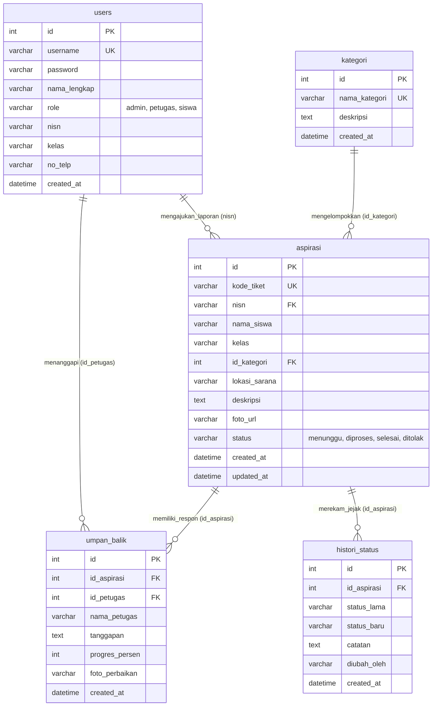

# Panduan & Dokumentasi ERD (Entity Relationship Diagram)
## Sistem Pengaduan Sarana Sekolah - SARPRAS CARE (UKK RPL 2025/2026 - Paket 3)
**Gaya Pemodelan:** MySQL Workbench Modeler Standard (Crow's Foot Notation)  
**Tingkat Normalisasi:** 3NF (Third Normal Form - Bebas Redundansi)  
**Engine Basis Data:** MySQL InnoDB / SQLite3 Relational Engine  

---

## 1. Visualisasi Diagram ERD (MySQL Workbench Modeler)

Berikut adalah diagram fisik skema basis data `pengaduan_sarana_sekolah` yang dimodelkan persis dengan standar visual MySQL Workbench Modeler:

> **File Sumber Kanvas & Gambar:**
> - Berkas HTML Interaktif: [assets/erd_workbench.html](file:///d:/belajar%20ukk%20rust/ukk3/assets/erd_workbench.html)
> - Berkas Gambar Resolusi Tinggi (1400 × 600 px): [assets/erd_diagram.png](file:///d:/belajar%20ukk%20rust/ukk3/assets/erd_diagram.png)
> - Slide Presentasi Sidang UKK: [Presentasi_Pengaduan_Sarana_UKK3.pptx](file:///d:/belajar%20ukk%20rust/ukk3/Presentasi_Pengaduan_Sarana_UKK3.pptx)

---

## 2. Diagram Konseptual Relasi (Mermaid Notation)

---

## 3. Kamus Data Teknis (5 Tabel Ternormalisasi)

### A. Tabel `users` (Data Akun Pengguna)
| Kolom | Tipe Data | Nullable | Keterangan & Batasan |
| :--- | :--- | :---: | :--- |
| `id` | `INTEGER(11)` | **NO** | **Primary Key**, Auto Increment |
| `username` | `VARCHAR(50)` | **NO** | Kredensial unik login sistem |
| `password` | `VARCHAR(255)` | **NO** | Sandi terenkripsi hash aman |
| `nama_lengkap` | `VARCHAR(100)` | **NO** | Nama lengkap personil |
| `role` | `VARCHAR(20)` | **NO** | Check: `'admin'`, `'petugas'`, `'siswa'` |
| `nisn` | `VARCHAR(20)` | YES | Nomor Induk Siswa Nasional (jika siswa) |
| `kelas` | `VARCHAR(20)` | YES | Kelas siswa (misal: XII RPL 1) |
| `no_telp` | `VARCHAR(20)` | YES | Kontak pelapor |
| `created_at` | `DATETIME` | **NO** | Default: `CURRENT_TIMESTAMP` |

### B. Tabel `kategori` (Klasifikasi Jenis Sarana)
| Kolom | Tipe Data | Nullable | Keterangan & Batasan |
| :--- | :--- | :---: | :--- |
| `id` | `INTEGER(11)` | **NO** | **Primary Key**, Auto Increment |
| `nama_kategori` | `VARCHAR(100)` | **NO** | Unique, contoh: Meubelair, Kelistrikan, IT |
| `deskripsi` | `TEXT` | YES | Penjelasan cakupan fasilitas |
| `created_at` | `DATETIME` | **NO** | Timestamp pembuatan |

### C. Tabel `aspirasi` (Laporan Pengaduan Siswa)
| Kolom | Tipe Data | Nullable | Keterangan & Batasan |
| :--- | :--- | :---: | :--- |
| `id` | `INTEGER(11)` | **NO** | **Primary Key**, Auto Increment |
| `kode_tiket` | `VARCHAR(30)` | **NO** | Unique kode pelacakan: `ASP-YYYYMMDD-XXXX` |
| `nisn` | `VARCHAR(20)` | **NO** | NISN pelapor siswa |
| `nama_siswa` | `VARCHAR(100)` | **NO** | Nama siswa pelapor |
| `kelas` | `VARCHAR(30)` | **NO** | Rombel kelas pelapor |
| `id_kategori` | `INTEGER(11)` | **NO** | **Foreign Key** `kategori(id)` `ON DELETE RESTRICT` |
| `lokasi_sarana` | `VARCHAR(150)` | **NO** | Posisi ruangan / fasilitas rusak |
| `deskripsi` | `TEXT` | **NO** | Uraian kerusakan fasilitas |
| `foto_url` | `VARCHAR(255)` | YES | Tautan berkas bukti visual kerusakan |
| `status` | `VARCHAR(20)` | **NO** | `'menunggu'`, `'diproses'`, `'selesai'`, `'ditolak'` |
| `created_at` | `DATETIME` | **NO** | Waktu pengaduan diajukan |
| `updated_at` | `DATETIME` | **NO** | Waktu pembaruan status |

### D. Tabel `umpan_balik` (Respon & Tindak Lanjut Petugas)
| Kolom | Tipe Data | Nullable | Keterangan & Batasan |
| :--- | :--- | :---: | :--- |
| `id` | `INTEGER(11)` | **NO** | **Primary Key**, Auto Increment |
| `id_aspirasi` | `INTEGER(11)` | **NO** | **Foreign Key** `aspirasi(id)` `ON DELETE CASCADE` |
| `id_petugas` | `INTEGER(11)` | YES | **Foreign Key** `users(id)` `ON DELETE SET NULL` |
| `nama_petugas` | `VARCHAR(100)` | **NO** | Nama petugas yang merespon |
| `tanggapan` | `TEXT` | **NO** | Penjelasan teknis penanganan |
| `progres_persen` | `INTEGER(5)` | **NO** | Check: `0` s.d. `100` (%) |
| `foto_perbaikan` | `VARCHAR(255)` | YES | Foto bukti fisik setelah diperbaiki |
| `created_at` | `DATETIME` | **NO** | Waktu tanggapan diberikan |

### E. Tabel `histori_status` (Audit Jejak Status Pengaduan)
| Kolom | Tipe Data | Nullable | Keterangan & Batasan |
| :--- | :--- | :---: | :--- |
| `id` | `INTEGER(11)` | **NO** | **Primary Key**, Auto Increment |
| `id_aspirasi` | `INTEGER(11)` | **NO** | **Foreign Key** `aspirasi(id)` `ON DELETE CASCADE` |
| `status_lama` | `VARCHAR(30)` | **NO** | Status sebelum perubahan |
| `status_baru` | `VARCHAR(30)` | **NO** | Status sesudah perubahan |
| `catatan` | `TEXT` | YES | Alasan perubahan status |
| `diubah_oleh` | `VARCHAR(100)` | **NO** | User / Petugas pelaku update |
| `created_at` | `DATETIME` | **NO** | Waktu pencatatan log histori |

---

## 4. Pembuktian Normalisasi Basis Data (3NF)

1. **1NF (Bentuk Normal Pertama):**
   - Tiap atribut menyimpan nilai tunggal yang tidak dapat dipecah lagi.
   - Tidak ada kolom array foto bukti atau respon berganda dalam baris tunggal aspirasi. Tanggapan dipisah ke entitas `umpan_balik`.
2. **2NF (Bentuk Normal Kedua):**
   - Memenuhi 1NF.
   - Seluruh atribut non-kunci bergantung secara fungsional penuh pada Primary Key entitas masing-masing.
3. **3NF (Bentuk Normal Ketiga):**
   - Memenuhi 2NF.
   - Tidak ada ketergantungan transitif. Kategori fasilitas dipisah ke master `kategori` sehingga bila nama kategori diperbarui, tidak perlu meng-update puluhan ribu baris data `aspirasi`.

---

## 5. Pertanyaan Kritis Uji Kompetensi Keahlian (UKK)

| Pertanyaan Penguji | Strategi Jawaban Siswa |
| :--- | :--- |
| **"Mengapa menggunakan ON DELETE CASCADE pada tabel umpan_balik?"** | "Karena umpan balik merupakan entitas turunan (*weak dependency*) dari laporan aspirasi. Jika sebuah laporan aspirasi dihapus, log tanggapan dan historinya otomatis ikut terhapus agar tidak terjadi data sampah (*garbage data*)." |
| **"Mengapa status perubahan dicatat di tabel histori_status?"** | "Untuk menjaga transparansi dan akuntabilitas tindak lanjut sarana prasarana sekolah (*audit trail*), sehingga siswa dan kepala sekolah dapat mengetahui kapan dan oleh siapa status laporan diperbarui." |
