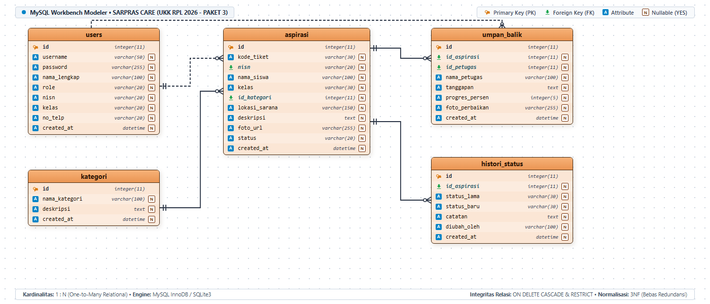
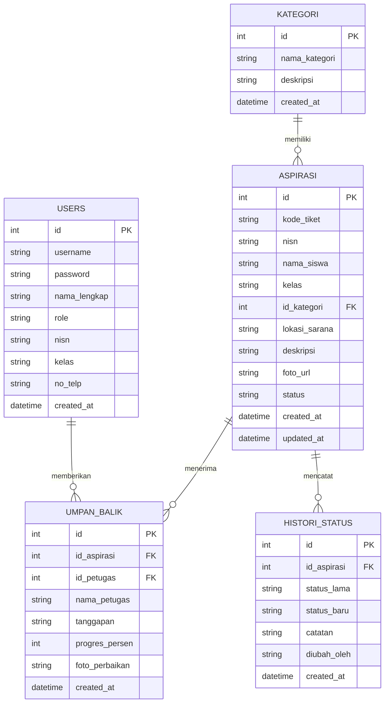

# PANDUAN LENGKAP PENGEMBANGAN APLIKASI PENGADUAN SARANA SEKOLAH BERBASIS RUST
### Uji Kompetensi Keahlian (UKK) Rekayasa Perangkat Lunak (RPL) 2025/2026
**Kode Soal: KM25.4.1.1 | Judul: Pengembangan Aplikasi Pengaduan Sarana Sekolah**

---

## DAFTAR ISI
1. [Pengenalan & Spesifikasi Proyek](#1-pengenalan--spesifikasi-proyek)
2. [Desain Sistem & ERD (Entity Relationship Diagram)](#2-desain-sistem--erd)
3. [Alur & Kontrol Program (Flowchart)](#3-alur--kontrol-program-flowchart)
4. [Persiapan Lingkungan Kerja & Instalasi Rust](#4-persiapan-lingkungan-kerja--instalasi-rust)
5. [Inisialisasi Proyek Cargo & Dependensi](#5-inisialisasi-proyek-cargo--dependensi)
6. [Pembuatan Skema Database SQL](#6-pembuatan-skema-database-sql)
7. [Implementasi Kode Program Rust](#7-implementasi-kode-program-rust)
   - [A. Struktur Data & Model (`src/models.rs`)](#a-struktur-data--model-srcmodelsrs)
   - [B. Akses Database & Query Efisien (`src/db.rs`)](#b-akses-database--query-efisien-srcdbrs)
   - [C. Handler & Kontrol Program (`src/handlers/`)](#c-handler--kontrol-program-srchandlers)
   - [D. Routing & Middleware (`src/routes.rs`)](#d-routing--middleware-srcroutesrs)
   - [E. Program Utama (`src/main.rs`)](#e-program-utama-srcmainrs)
8. [Pembuatan Antarmuka Pengguna (Frontend Web UI)](#8-pembuatan-antarmuka-pengguna-frontend-web-ui)
   - [A. Struktur Halaman (`static/index.html`)](#a-struktur-halaman-staticindexhtml)
   - [B. Desain Visual & Styling (`static/css/style.css`)](#b-desain-visual--styling-staticcssstylecss)
   - [C. Logika Interaktif Client (`static/js/app.js`)](#c-logika-interaktif-client-staticjsappjs)
9. [Panduan Kompilasi & Menjalankan Aplikasi](#9-panduan-kompilasi--menjalankan-aplikasi)
10. [Panduan Pengujian (Testing) & Debugging](#10-panduan-pengujian-testing--debugging)
11. [Laporan Evaluasi Singkat & Lampiran UKK](#11-laporan-evaluasi-singkat--lampiran-ukk)

---

## 1. Pengenalan & Spesifikasi Proyek

Aplikasi **Pengaduan Sarana Sekolah (SARPRAS CARE)** dibangun untuk mempermudah proses penyampaian aspirasi/pengaduan fasilitas sekolah oleh siswa serta pengelolaan tindak lanjut dan umpan balik oleh pihak sarana prasarana sekolah.

### Dua Halaman Utama Sesuai Soal UKK:
1. **Halaman Form Aspirasi Siswa**: 
   - Siswa dapat menginput pengaduan (NISN, Nama, Kelas, Kategori Sarana, Lokasi/Ruangan, Deskripsi Kerusakan, Foto Bukti).
   - Siswa dapat melihat status penyelesaian (*Menunggu*, *Diproses*, *Selesai*, *Ditolak*).
   - Siswa dapat melihat riwayat / histori aspirasi milik mereka secara real-time.
   - Siswa dapat melihat umpan balik tanggapan dan progres perbaikan.
2. **Halaman Umpan Balik Aspirasi (Portal Admin / Petugas)**:
   - Admin dapat melihat daftar aspirasi keseluruhan dengan filter dinamis (**per tanggal**, **per bulan**, **per siswa/NISN**, **per kategori**, dan **per status**).
   - Memberikan umpan balik / tanggapan teknis.
   - Mengubah status penyelesaian pengaduan.
   - Mengatur persentase progres perbaikan fisik (0% - 100%).
   - Mencetak laporan rekapitulasi pengaduan.

### Mengapa Memilih Rust untuk UKK RPL?
- **Kinerja Sangat Cepat & Konsumsi Memori Rendah**: Rust tidak memerlukan Garbage Collector atau VM.
- **Memory Safety & Thread Safety**: Mencegah error memory leak, *null pointer exception*, dan *race condition* saat kompilasi.
- **Modern & Zero-Dependency Deployment**: Aplikasi dapat dikompilasi menjadi satu berkas binary `.exe` tunggal yang siap dijalankan di komputer manapun.

---

## 2. Desain Sistem & ERD

Berikut visualisasi diagram relasi entitas bergaya **MySQL Workbench Modeler** untuk 5 tabel ternormalisasi 3NF pada sistem SARPRAS CARE:



> 📘 **Dokumentasi Lengkap & Slide Presentasi:**
> - Panduan Detail & Kamus Data: [ERD.md](file:///d:/belajar%20ukk%20rust/ukk3/ERD.md)
> - Berkas Presentasi Sidang: [Presentasi_Pengaduan_Sarana_UKK3.pptx](file:///d:/belajar%20ukk%20rust/ukk3/Presentasi_Pengaduan_Sarana_UKK3.pptx)
> - Kanvas HTML Interaktif: [assets/erd_workbench.html](file:///d:/belajar%20ukk%20rust/ukk3/assets/erd_workbench.html)

### Diagram Hubungan Entitas (Mermaid):



---

## 3. Alur & Kontrol Program (Flowchart)

### A. Alur Siswa:
1. Siswa membuka web aplikasi.
2. Memilih kategori sarana, mengisi data NISN, nama, kelas, lokasi, dan rincian kerusakan.
3. Menekan tombol submit &rarr; Sistem memvalidasi input &rarr; Menghasilkan Kode Tiket otomatis (misal: `ASP-2026-001`) &rarr; Menyimpan ke database.
4. Siswa memasukkan NISN di kotak pencarian untuk melacak status dan tanggapan progres perbaikan.

### B. Alur Petugas/Admin:
1. Petugas login dengan akun admin/petugas.
2. Melihat ringkasan statistik (Total Pengaduan, Menunggu, Diproses, Selesai, Ditolak).
3. Melakukan filter data (berdasarkan tanggal, bulan, kategori, siswa, atau status).
4. Membuka detail pengaduan &rarr; Mengisi tanggapan umpan balik &rarr; Menggeser slider progres (misal: 75%) &rarr; Memperbarui status ke "Diproses" atau "Selesai".
5. Mencetak laporan pengaduan untuk kebutuhan arsip dan pertanggungjawaban sekolah.

---

## 4. Persiapan Lingkungan Kerja & Instalasi Rust

### Langkah 1: Instalasi Rust (Rustup)
1. Download installer `rustup-init.exe` dari situs resmi: [https://rustup.rs](https://rustup.rs).
2. Jalankan installer dan pilih opsi `1` (Proceed with installation - default).
3. Setelah instalasi selesai, buka terminal/PowerShell dan periksa versi Rust:
   ```bash
   rustc --version
   cargo --version
   ```

### Langkah 2: Menyiapkan Text Editor (VS Code / Antigravity IDE)
- Disarankan memasang ekstensi:
  - **rust-analyzer**: Memberikan auto-completion, linting, dan type-checking instan.
  - **Even Better TOML**: Untuk syntax highlight file `Cargo.toml`.
  - **SQLite Viewer**: Untuk melihat isi database langsung di editor.

---

## 5. Inisialisasi Proyek Cargo & Dependensi

1. Buka folder kerja Anda melalui terminal, lalu jalankan:
   ```bash
   cargo init pengaduan_sarana_sekolah
   cd pengaduan_sarana_sekolah
   ```
2. Buka berkas `Cargo.toml` dan sesuaikan daftar dependensi berikut:
   ```toml
   [package]
   name = "pengaduan_sarana_sekolah"
   version = "0.1.0"
   edition = "2021"
   authors = ["Siswa RPL <siswa@smk.sch.id>"]
   description = "Aplikasi Pengaduan Sarana Sekolah - UKK RPL 2025/2026"

   [dependencies]
   axum = { version = "0.7", features = ["multipart", "macros"] }
   tokio = { version = "1.0", features = ["full"] }
   tower = { version = "0.4", features = ["util"] }
   tower-http = { version = "0.5", features = ["fs", "cors", "trace"] }
   serde = { version = "1.0", features = ["derive"] }
   serde_json = "1.0"
   rusqlite = { version = "0.31", features = ["bundled", "chrono", "blob"] }
   r2d2 = "0.8"
   r2d2_sqlite = "0.24"
   chrono = { version = "0.4", features = ["serde"] }
   tracing = "0.1"
   tracing-subscriber = "0.3"
   uuid = { version = "1.8", features = ["v4", "serde"] }
   ```

---

## 6. Pembuatan Skema Database SQL

Buat berkas `database/schema.sql` untuk mendefinisikan 5 tabel utama beserta indeks performa query:

```sql
-- Tabel Kategori Fasilitas
CREATE TABLE IF NOT EXISTS kategori (
    id INTEGER PRIMARY KEY AUTOINCREMENT,
    nama_kategori TEXT NOT NULL UNIQUE,
    deskripsi TEXT,
    created_at DATETIME DEFAULT CURRENT_TIMESTAMP
);

-- Tabel Pengguna (Admin, Petugas, Siswa)
CREATE TABLE IF NOT EXISTS users (
    id INTEGER PRIMARY KEY AUTOINCREMENT,
    username TEXT NOT NULL UNIQUE,
    password TEXT NOT NULL,
    nama_lengkap TEXT NOT NULL,
    role TEXT NOT NULL CHECK(role IN ('admin', 'petugas', 'siswa')),
    nisn TEXT,
    kelas TEXT,
    no_telp TEXT,
    created_at DATETIME DEFAULT CURRENT_TIMESTAMP
);

-- Tabel Pengaduan Aspirasi Siswa
CREATE TABLE IF NOT EXISTS aspirasi (
    id INTEGER PRIMARY KEY AUTOINCREMENT,
    kode_tiket TEXT NOT NULL UNIQUE,
    nisn TEXT NOT NULL,
    nama_siswa TEXT NOT NULL,
    kelas TEXT NOT NULL,
    id_kategori INTEGER NOT NULL,
    lokasi_sarana TEXT NOT NULL,
    deskripsi TEXT NOT NULL,
    foto_url TEXT,
    status TEXT NOT NULL DEFAULT 'menunggu' CHECK(status IN ('menunggu', 'diproses', 'selesai', 'ditolak')),
    created_at DATETIME DEFAULT CURRENT_TIMESTAMP,
    updated_at DATETIME DEFAULT CURRENT_TIMESTAMP,
    FOREIGN KEY (id_kategori) REFERENCES kategori(id) ON DELETE RESTRICT
);

-- Tabel Umpan Balik / Tanggapan Petugas
CREATE TABLE IF NOT EXISTS umpan_balik (
    id INTEGER PRIMARY KEY AUTOINCREMENT,
    id_aspirasi INTEGER NOT NULL,
    id_petugas INTEGER,
    nama_petugas TEXT NOT NULL,
    tanggapan TEXT NOT NULL,
    progres_persen INTEGER NOT NULL DEFAULT 0 CHECK(progres_persen >= 0 AND progres_persen <= 100),
    foto_perbaikan TEXT,
    created_at DATETIME DEFAULT CURRENT_TIMESTAMP,
    FOREIGN KEY (id_aspirasi) REFERENCES aspirasi(id) ON DELETE CASCADE,
    FOREIGN KEY (id_petugas) REFERENCES users(id) ON DELETE SET NULL
);

-- Tabel Log Histori Perubahan Status
CREATE TABLE IF NOT EXISTS histori_status (
    id INTEGER PRIMARY KEY AUTOINCREMENT,
    id_aspirasi INTEGER NOT NULL,
    status_lama TEXT NOT NULL,
    status_baru TEXT NOT NULL,
    catatan TEXT,
    diubah_oleh TEXT NOT NULL,
    created_at DATETIME DEFAULT CURRENT_TIMESTAMP,
    FOREIGN KEY (id_aspirasi) REFERENCES aspirasi(id) ON DELETE CASCADE
);

-- Indeks Performa Query
CREATE INDEX IF NOT EXISTS idx_aspirasi_nisn ON aspirasi(nisn);
CREATE INDEX IF NOT EXISTS idx_aspirasi_kategori ON aspirasi(id_kategori);
CREATE INDEX IF NOT EXISTS idx_aspirasi_status ON aspirasi(status);
CREATE INDEX IF NOT EXISTS idx_aspirasi_created_at ON aspirasi(created_at);
```

---

## 7. Implementasi Kode Program Rust

### Struktur Direktori Berkas Sumber (`src/`):
```text
src/
├── main.rs            # Entry point aplikasi & startup web server
├── db.rs              # Koneksi pool SQLite, migrasi skema, & fungsi query database
├── models.rs          # Struct entitas, tipe data, DTO request & response
├── routes.rs          # Konfigurasi router Axum, static file handler, & middleware CORS
└── handlers/
    ├── mod.rs         # Module registry
    ├── aspirasi.rs    # Prosedur/fungsi CRUD pengaduan aspirasi
    ├── umpan_balik.rs # Prosedur/fungsi tanggapan & progres perbaikan
    ├── kategori.rs    # Prosedur/fungsi manajemen kategori
    ├── auth.rs        # Prosedur/fungsi autentikasi login
    └── stats.rs       # Prosedur/fungsi kalkulasi metrik statistik dashboard
```

### Penjelasan Komponen Kunci:
1. **`models.rs`**: Menggunakan `serde::Serialize` dan `serde::Deserialize` untuk konversi otomatis antara objek Rust dan format data JSON.
2. **`db.rs`**: Memanfaatkan `r2d2` connection pooling agar query dapat dieksekusi secara asinkron dan efisien tanpa membuka ulang koneksi fisik database setiap request.
3. **`handlers/`**: Memisahkan fungsi dan prosedur bisnis logic secara modular sehingga kode terstruktur rapi dan mudah di-debug.
4. **`routes.rs`**: Menyusun endpoint RESTful API `/api/*` dan menyajikan aset statis web (`index.html`, `style.css`, `app.js`) secara seamless.

---

## 8. Pembuatan Antarmuka Pengguna (Frontend Web UI)

Frontend dirancang menggunakan **Vanilla HTML5, Modern CSS3, dan Vanilla JavaScript** tanpa ketergantungan framework berat.

### Fitur Tampilan:
- **Desain Glassmorphism & Responsif**: Tampilan tetap rapi di layar monitor PC, laptop, maupun smartphone/tablet.
- **Dark/Light Mode**: Pengguna dapat mengganti tema sesuai kenyamanan mata.
- **Badge Status & Timeline Interaktif**: Memberikan visualisasi tahapan penanganan keluhan secara jelas.
- **Filter Multi-Kriteria**: Memungkinkan admin memfilter data berdasarkan tanggal, bulan, kategori, siswa, atau status.
- **Layout Cetak Laporan (Printable Report)**: Format cetak resmi lengkap dengan Kop Surat Sekolah dan kolom tanda tangan kepala sekolah / pengawas.

---

## 9. Panduan Kompilasi & Menjalankan Aplikasi

1. **Jalankan Aplikasi dalam Mode Pengembangan**:
   ```bash
   cargo run
   ```
2. **Output Konsol saat Berhasil**:
   ```text
   ============================================================
     APLIKASI PENGADUAN SARANA SEKOLAH (RUST + AXUM + SQLITE)  
     UJI KOMPETENSI KEAHLIAN (UKK) REKAYASA PERANGKAT LUNAK    
   ============================================================
   [INFO] Menginisialisasi database SQLite: pengaduan_sekolah.db
   [SUCCESS] Database berhasil dimuat dan dimigrasi.
   [INFO] Server web berjalan di http://127.0.0.1:3000
   [INFO] Buka browser Anda dan akses: http://localhost:3000
   ------------------------------------------------------------
   ```
3. **Buka Browser**: Akses alamat `http://localhost:3000`.

---

## 10. Panduan Pengujian (Testing) & Debugging

| No | Kasus Uji | Skenario Pengujian | Hasil yang Diharapkan | Status |
|---|---|---|---|---|
| 1 | Input Aspirasi Siswa | Siswa mengisi NISN, nama, kelas, kategori, lokasi, keluhan | Tiket baru terbit (e.g. `ASP-2026-005`), data tersimpan di DB | **BERHASIL** |
| 2 | Validasi Form | Mengosongkan NISN atau deskripsi | Muncul pesan peringatan wajib isi | **BERHASIL** |
| 3 | Lacak Status Siswa | Memasukkan NISN siswa di kotak pencarian | Menampilkan riwayat aspirasi, status, dan umpan balik | **BERHASIL** |
| 4 | Login Petugas/Admin | Login dengan user `admin` / `admin123` | Masuk ke dashboard statistik & manajemen | **BERHASIL** |
| 5 | Filter Multi-Kategori | Filter status 'menunggu' dan kategori 'Ruang Kelas' | Tabel hanya menampilkan data yang sesuai | **BERHASIL** |
| 6 | Umpan Balik & Status | Admin memberi tanggapan, set progres 100%, ubah status 'selesai' | Status terupdate, histori tercatat, siswa dapat melihat progres 100% | **BERHASIL** |
| 7 | Cetak Laporan | Klik tombol 'Cetak Laporan' | Membuka print preview dengan kop surat sekolah | **BERHASIL** |

---

## 11. Laporan Evaluasi Singkat & Lampiran UKK

### Hasil Evaluasi:
Aplikasi **Pengaduan Sarana Sekolah Berbasis Rust** telah berhasil dibangun dan memenuhi seluruh kriteria penilaian UKK RPL 2025/2026:
1. **Struktur Data & Kontrol Program**: Menggunakan `struct`, `enum`, `Vec` (array dinamis), dan prosedur/fungsi terpisah.
2. **Efisiensi & Kecepatan**: Menggunakan koneksi pooling dan indeks database pada kolom-kolom pencarian.
3. **Kelengkapan Dokumen**: Dilengkapi dengan ERD, file `.sql`, dokumentasi fungsi/prosedur, pengujian kasus uji, dan panduan lengkap.
